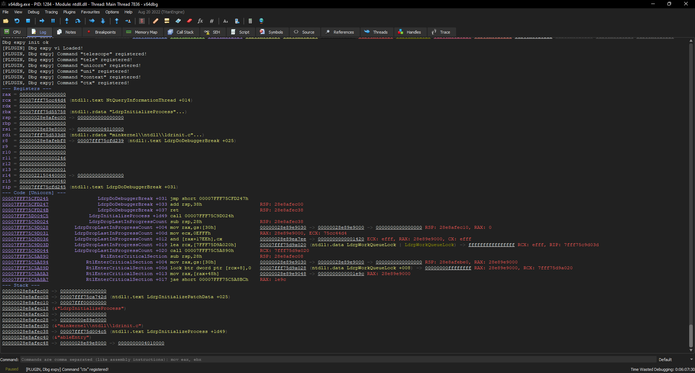

This is the library that extends x64dbg with new features:

* Telescope. It's basically recursive dereferencerer of memory view which looks at the pointers in memory region recursively and extracting information from that memory: symbol, module with section name or string.
* Unicorn emulator to replace the disassembly window. Instead of linear disassembly now you see wich assembly lines is actually going to be executed with propogated values in the registers. This allows you to save time on single stepping or double clicking on jumps in disassembly view.

Both features actually inspired by projects like [GEF](https://github.com/hugsy/gef) and [pwndbg](https://github.com/pwndbg/pwndbg).

# Install

Copy `ext.dp64` (original file name `x64dbg_ext.dll`) to x64dbg plugins directory.

# Usage

Plugin adds three commands:

* `telescope` recursive symbolic dereferencer.
* `unicorn` emulation with symbolic traces.
* `context` print current context, instead of disasm print `unicorn` output and apply `telescope` to the stack.

Here is how `context` looks like:



# Build

You need at least rust 1.64.0 (at the time of writing beta: `rustup install beta`)

Set `LIBCLANG_PATH` for bindgen to work.

```
set LIBCLANG_PATH=C:\Program Files\LLVM\bin
rustup run beta
cargo build --release
```

## Development build

Build [PluginDevHelper](https://github.com/x64dbg/PluginDevHelper), then:

```
mklink target\release\x64dbg_ext.dll <x64dbg plugins>\ext.dp64
PluginDevServer.exe

PluginDevBuildTool.exe unload <x64dbg plugins>\ext.dp64
cargo build --release
PluginDevBuildTool.exe reload <x64dbg plugins>\ext.dp64
```

# Limitations

* Performance issues. Just initializing Unicorn context takes ~1GB of RAM.
* User experience. Logs tab, despite having html support, is probably not a best place to have a UI.

# Thanks to

Special thanks for [@mrexodia](https://github.com/mrexodia) for creating and maintaing x64dbg, consider [donating](https://github.com/sponsors/mrexodia?metadata_source=x64dbg-site).
